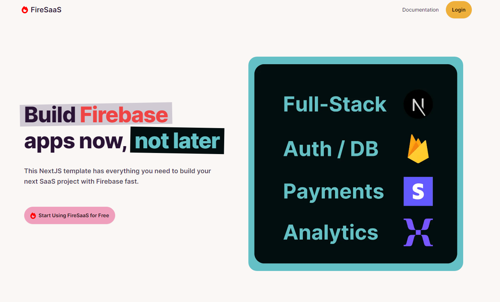

# FireSaaS Project

## **Overview**

FireSaaS is an integrated SaaS (Software as a Service) solution that leverages Firebase, Stripe, and other technologies to create a seamless and scalable platform for SaaS businesses. This project encapsulates key functionalities like user authentication, subscription management, and payment processing, making it easier for developers to build and manage SaaS applications.

## **Updates**

Firebase App Hosting support WIP (GCP Removes Cookies on requests)

## **Key Features**

- **Firebase Integration**: Utilizes Firebase for backend services including authentication and database management.
- **Stripe for Payments**: Integrates Stripe for handling subscriptions and payments.
- **Security**: Implements Firestore security rules for data protection.
- **Extensible Architecture**: Designed for easy customization and scalability to suit various SaaS requirements.

## **Why did I build this?**

I built this because so many people that make SaaS templates charge a lot of money for them, and the ones that exist don't use technologies that I like (I enjoy Firebase quite a bit.)

I also have a goal to make a lot of small SaaS apps this year, so this is fulfilling a personal need of being tired of implementing Stripe and Firebase over and over again.

## **Getting Started**

To get started with FireSaaS:

- **Clone the Repository**: Download the project to your local machine.
- **Environment Setup**: Configure the necessary environment variables for Firebase, Stripe, and other services.
- **Firebase and Stripe Configuration**: Follow the detailed setup instructions in our [documentation.](https://docs.firesaas.dev)
- **Local Development**: Use `yarn dev` to start the development server locally.

## **Documentation**

For detailed setup instructions, features, and guides, please refer to our [comprehensive documentation.](https://docs.firesaas.dev)

## **Support the Project**

Visit https://firesaas.dev to learn more about the project. I take donations on that page.

## **Want me to build your SaaS app?**

I do consulting, fill out the form on https://firesaas.dev or contact me on [Twitter](https://twitter.com/addicted_to_ai)

## **Contributing**

Contributions are welcome! If you have ideas for improvements or encounter any issues, please feel free to open an issue or submit a pull request.
