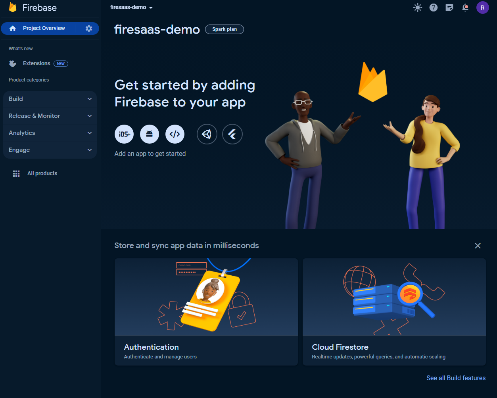
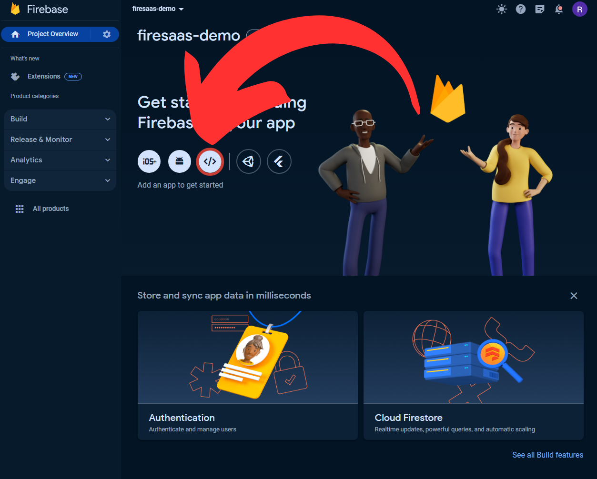
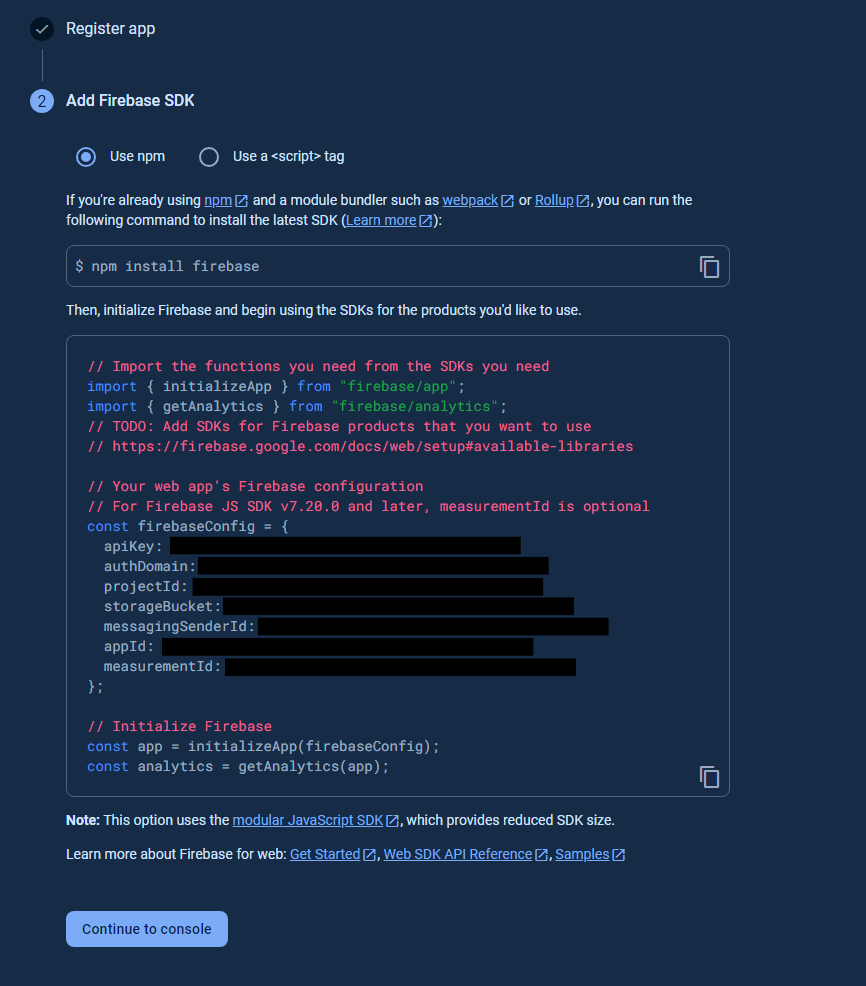
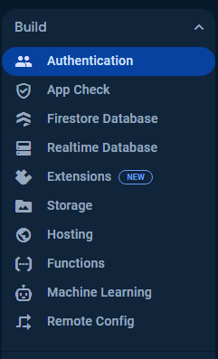
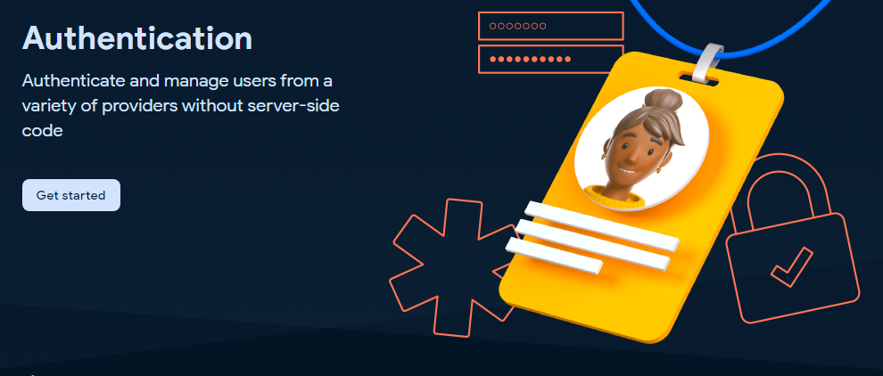
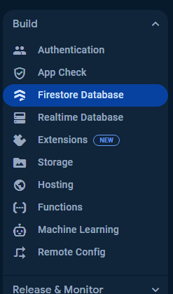
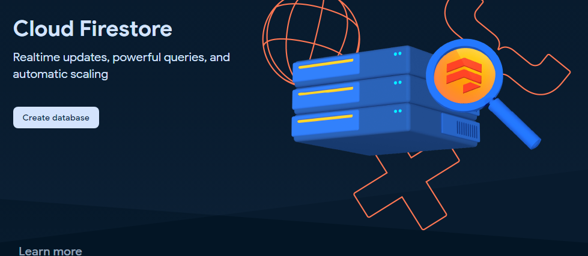
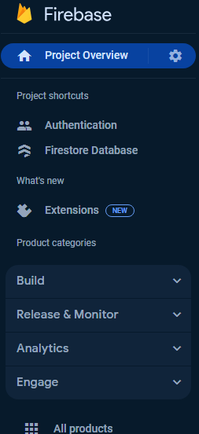
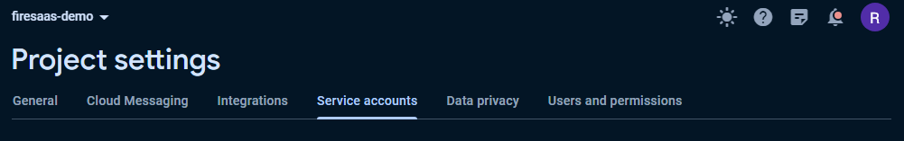
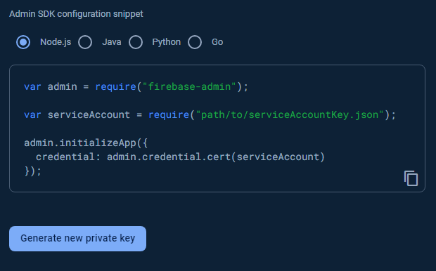

# How to Setup FireSaaS

## Getting your Firebase Env Vars

Once you pull down the repo, you'll have a base FireSaaS project. You really will just need to start by plugging in some env vars.

To start, create a new Firebase Project

Once you have a new project open on Firebase it'll look something like this



Click on the web button here



It will ask you to give your app a name, name it whatever you like

(This project is setup to be hosted on Vercel not Firebase hosting, leave it unchecked for now unless you specifically want to host it on Firebase)

Then you will get the Add Firebase SDK screen, it will show you your Firebase Config, these values need to be added to the .env



Copy paste each value that I've blacked out and move it into your match variable in the .env.

Next you'll want to enable Auth and Firestore in Firebase. To do that just click on the Authentication option in the sidebar menu on the left.



And click the Get Started button on the page



We'll start by enabling Email / Password Auth and Google Auth because they are the easiest to implement.

Click Email/Password under the Sign-in method tab of the authentication page.

Now Click Save

You'll now see an Add new provider button, click it to enable Google Auth

Choose Google from the list of additional providers.

Click the enable toggle to enable.

Choose a public facing name for you project (Your users will see this, just name it your app's / company's name)

and configure a support email for the project (most likely just your email already connected to firebase.)

Auth is done, now go setup Firestore



Now click the Create Database button



Set the location to the most appropriate location for your users (or just leave it on the default)

Go ahead and start in test mode for now, this will leave your db open to reads and writes until a specific date. You can define more specific rules later.

The last step is setting up firebase admin by creating a service account and copy pasting the service account values into your .env

Click settings gear in project overview in the top left and click Project Settings



Click the Service Accounts tab



Click Generate new private key



This will download a JSON file containing your key information. The easiest way to use this private key in my opinion is to open it up in a text editor and copy paste the important values we need to setup Firebase Admin into your .env

Open the file and copy the entire private_key value and the client_email value into your .env

That's all the Firebase Specific env vars.

## Deploying Functions

I prepackaged one function in this project. It creates database entries for your users when they create an account. Let's go ahead and deploy those now.

### Adding project ID

First we have to open the .firebaserc file inside the project.

Add your project id here, you should have your project id in your Env Vars already so copy it from there.

### Setup Firebase CLI

Make sure you have the Firebase CLI setup

`npm install -g firebase-tools`

This installs firebase globally on your machine.

Now we login

`firebase login`

Once you're logged in, cd into the functions directory

Then we can run yarn deploy, once this finishes your functions are live.

### Using the functions project

You can run yarn serve inside the functions project to emulate functions locally. This is good for testing stuff out before you deploy.

## Setup Stripe

I'm going to assume you already have a Stripe account. First thing we need to do is grab your env vars for stripe.

We need the

```
NEXT_PUBLIC_STRIPE_PUBLISHABLE_KEY=""
STRIPE_SECRET_KEY=""
```

On your Stripe dashboard, hit Developers. (I recommend also hitting Test for local keys before you deploy anything to prod.)

Copy your publishable key and your secret key into the Env Vars.

### Setting up Customer Portal

Users need to be able to manage their account right? Stripe provides an easy way to give users this functionality through their hosted portal. But you have to turn it on.

Go to this url [https://dashboard.stripe.com/settings/billing/portal]()

You can customize the portal, but the most important thing is to simply enable it with the button on the left. Once enabled you're good to go (this project grabs customer portal links already!)

## Stripe-Firebase Extension

Stripe provides us with a Firebase extension, we're going to enable that.

Basically it helps us synchronize Stripe data with Firebase Firestore.

Keep the Stripe dashboard open because you'll need it soon.

This is the url to the Stripe extension [https://extensions.dev/extensions/stripe/firestore-stripe-payments]()

Install it.

IMPORTANT in the settings for the extension, we're going to rename the Customer details and subscriptions collection to our users collection.


Go back to the stripe dashboard, Developers -> API Keys

Generate a new Restricted Key with

- Write access to Customers
- Write access to Checkout Sessions
- Write access to Customer Portal
- Read access to Subscriptions

Once saved, copy the Restricted Key and put it in the Firebase Extension config as Stripe API Key with Restricted Access.

Now you can hit Install Extension (this will take a minute)

### Firestore Security Rules

I recommend these Firestore security rules when using this extension

```
rules_version = '2';
service cloud.firestore {
  match /databases/{database}/documents {
    match /users/{uid} {
      allow read, write: if request.auth.uid == uid;

      match /checkout_sessions/{id} {
        allow read, write: if request.auth.uid == uid;
      }
      match /subscriptions/{id} {
        allow read: if request.auth.uid == uid;
      }
    }

    match /products/{id} {
      allow read: if true;

      match /prices/{id} {
        allow read: if true;
      }

      match /tax_rates/{id} {
        allow read: if true;
      }
    }
  }
}
```

### Stripe Webhook

But wait, there's more to do. Now we need to setup our Stripe Webhook

To do that, we'll go back to our Stripe Dashboard, and click Developers > Webhooks.

Copy the url from the Firebase Extension "How this extension works" tab, and paste it as a new Endpoint in Stripe webhooks.

Select the following events to send to that endpoint:

- product.created
- product.updated
- product.deleted
- price.created
- price.updated
- price.deleted
- checkout.session.completed
- customer.subscription.created
- customer.subscription.updated
- customer.subscription.deleted
- tax_rate.created (optional)
- tax_rate.updated (optional)
- invoice.paid (optional, will sync invoices to Cloud Firestore)
- invoice.payment_succeeded (optional, will sync invoices to Cloud Firestore)
- invoice.payment_failed (optional, will sync invoices to Cloud Firestore)
- invoice.upcoming (optional, will sync invoices to Cloud Firestore)
- invoice.marked_uncollectible (optional, will sync invoices to Cloud Firestore)
- invoice.payment_action_required (optional, will sync invoices to Cloud Firestore)

Once the webhook is complete, copy the signing secret (we need to add it to the extension config)

Then Reconfigure your Extension, replacing the existing placeholder value within Stripe webhook secret to the webhook signing secret you just copied from the Stripe Dashboard.

### Adding Products to Stripe

Let's create a product inside Stripe, so that our users can upgrade their accounts to become Premium Users.

Back at the Stripe Dashboard, click on Products, and Add Product.

Enter the name of your product (something like "Premium Plan") and an optional description of the product.

Beneath that, open up the additional options section, and add a metadata field called firebaseRole with the value of premium.

This value will be attached to the user inside Firebase as a custom claim on the user.

This allows us to quickly see if a user is a premium customer or a free customer within the Firebase User itself. You can also extend your firebase rules to restrict access on the server-side, based on this custom claim.

The default SubscriptionCard components I wrote, really expect Two products, but you should customize it to fit your requirements.

NOTE My SubscriptionCard components also expect additional metadata for the products. You may want to skip this if you plan to customize how you display your products.

I add a buttonText metadata for the text on the purchase button and a popular metadata, to define if a product is popular or not (string of true or false)

## Setting up Mixpanel

Create a Mixpanel account and grab your project key. Slap it into the .env and you should be good to go. The default config for Mixpanel will not log events that happen on your local env.

## Site URL and Functions URL

You should have these as localhost for local .env

When deploying, you should update these to the deployed url ie. https://firesaas.dev

## Congrats

Your project should be setup to run, hit `yarn dev` and see if everything works properly. Now it's your turn to make something cool!
